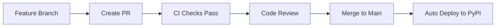

# 🌿 Branch Protection & Deployment Strategy

## **Overview**
This document outlines the branch protection rules and deployment strategy for the Django API Explorer project.

## **🚫 Branch Protection Rules**

### **Main Branch (`main`)**
- **Protected**: ✅ Yes
- **Requires PR**: ✅ Yes
- **Requires Reviews**: ✅ Yes (at least 1 approval)
- **Requires Status Checks**: ✅ Yes (all CI checks must pass)
- **Direct Push**: ❌ No (only through PR merge)

### **Feature Branches**
- **Protected**: ❌ No
- **Direct Push**: ✅ Yes
- **Deployment**: ❌ No (only main branch deploys)

## **🔄 Workflow Process**

### **1. Development Workflow**


### **2. Required Steps for Deployment**
1. **Create Feature Branch** from `main`
2. **Make Changes** and commit
3. **Push to Feature Branch**
4. **Create Pull Request** to `main`
5. **Wait for CI Checks** to pass:
   - ✅ Tests (all Python versions)
   - ✅ Linting (Black, Flake8, isort, MyPy)
   - ✅ Security (Bandit, Safety)
   - ✅ Build (package creation)
6. **Get Code Review** approval
7. **Merge to Main** (triggers deployment)
8. **Automatic PyPI Deployment**

## **🔒 CI/CD Pipeline**

### **Trigger Conditions**
- **Push to `main`**: ✅ Triggers full pipeline
- **PR to `main`**: ✅ Triggers test/lint/security
- **Push to feature branches**: ❌ No pipeline

### **Deployment Conditions**
- **Only on `main` branch**: ✅
- **All CI checks passed**: ✅
- **PR approved and merged**: ✅

## **📋 Branch Naming Convention**

### **Feature Branches**
```
feature/description-of-feature
feature/fix-duplicate-code
feature/add-new-feature
```

### **Bug Fix Branches**
```
bugfix/description-of-bug
bugfix/fix-import-error
```

### **Hotfix Branches**
```
hotfix/critical-security-fix
hotfix/urgent-bug-fix
```

## **🚀 Deployment Process**

### **Automatic Deployment**
1. **Code merged to `main`**
2. **CI pipeline runs automatically**
3. **All checks pass**
4. **Package built and uploaded to PyPI**
5. **Version 1.0.0 updated**

### **Manual Deployment (Emergency)**
- **Only for critical hotfixes**
- **Requires admin override**
- **Must be documented**

## **📝 PR Requirements**

### **Before Creating PR**
- [ ] All tests pass locally
- [ ] Code follows style guidelines
- [ ] No duplicate code
- [ ] Documentation updated
- [ ] Commit messages are clear

### **PR Description Template**
```markdown
## Description
Brief description of changes

## Type of Change
- [ ] Bug fix
- [ ] New feature
- [ ] Documentation update
- [ ] Code cleanup

## Testing
- [ ] Local tests pass
- [ ] Manual testing completed

## Checklist
- [ ] Code follows style guidelines
- [ ] No duplicate code
- [ ] Documentation updated
```

## **🔧 Local Development Setup**

### **Pre-commit Checks**
```bash
# Run all checks locally before pushing
./scripts/setup_dev.sh

# Or run individually:
black django_api_explorer/
flake8 django_api_explorer/
isort django_api_explorer/
mypy django_api_explorer/
pytest --cov=django_api_explorer
```

### **Branch Management**
```bash
# Create feature branch
git checkout -b feature/your-feature-name

# Keep main updated
git checkout main
git pull origin main
git checkout feature/your-feature-name
git rebase main
```

## **⚠️ Important Notes**

1. **Never push directly to `main`** - always use PRs
2. **All CI checks must pass** before merging
3. **Code review is mandatory** for all changes
4. **Deployment only happens from `main`** branch
5. **Feature branches are for development only**

## **🆘 Troubleshooting**

### **CI Checks Failing**
- Check local tests first
- Run linting tools locally
- Fix all issues before pushing

### **Merge Conflicts**
- Rebase your feature branch on latest main
- Resolve conflicts locally
- Push updated branch

### **Deployment Issues**
- Check CI pipeline logs
- Verify all checks passed
- Contact maintainers if needed
